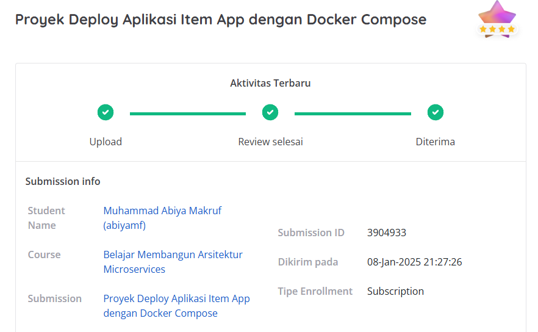

# Proyek Pertama: Dicoding-ProyekDeployAplikasiItemAppdenganDockerCompose

## Penilaian Proyek
Proyek ini berhasil mendapatkan bintang 4/5 pada submission dicoding course Belajar Membangun Arsitektur Microservices.

Kriteria tambahan yang saya kerjakan sehingga mendapat nilai terbaik:
1. Memberikan penjelasan dalam bentuk komentar untuk setiap perintah yang ada pada berkas Dockerfile, build_push_image.sh, dan docker-compose.yml.
2. Menerapkan restart policy pada berkas docker-compose.yml agar container selalu restart ketika terhenti.
3. Menyertakan berkas log.txt yang berisi logs ketika menggunakan Docker Compose.
